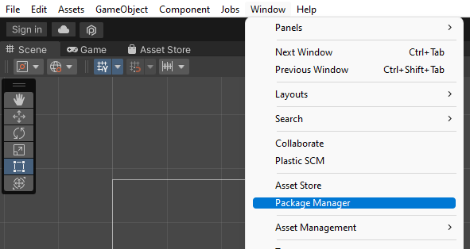
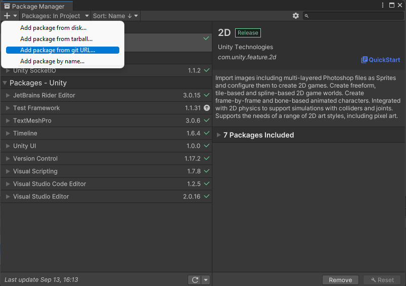
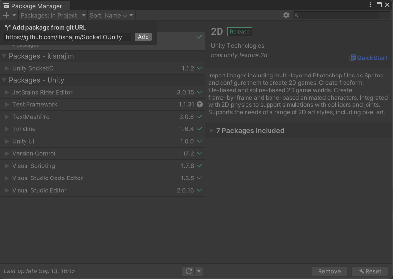
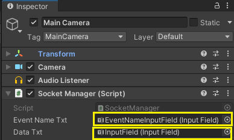
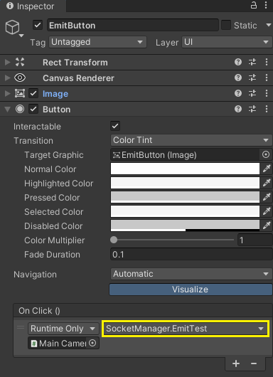

## [ DEGA Project ]
# Multiplayer Socket.io And Unity
Document สำหรับ ผู้เริ่มต้นในการทำระบบ multiplayer Unity โดยใช้ Server Node.js Socket.io และ Client Unity  
# สร้าง Project Srver : Socket.io 

ติดตั้ง [node.js](https://nodejs.org/en/)

สร้าง project ใน vscode พิมพ์ 
เพื่อเช็คเวอร์ชั้น node .js 
```console
node –v
``` 
พิมพ์คำสั่ง `npm init` เพื่อทำการสร้างโปรเจค
```console
npm init 
```
ลง package `socket.io` `nodemon` 
```console
npm install socket.io
npm install nodemon
```
พิมพ์คำสั่ง `npm i`  เพื่อ ติดตั้ง package 
```console
npm i
```

<br>

## ตั้งค่า node package ให้เป็น node module


1. สร้างไฟล์ index.js

2. แก้ไข `package.json`

3. เพิ่ม type module และ `"type":"module",` เพื่อใช้งาน import module ใน js file

4. start nodemon index.js  ใน `"script"`

5. เพิ่ม `"start": "nodemon index.js"` เพื่อให้ server ทำงาน script กำหนดไว้
```json
  "type":"module",
  "scripts": {
    "start": "nodemon index.js"
  }
```

6. terminal : npm start เปิดใช้งาน server
```console
npm start
```
7. terminal : rs เพื่อ restart server nodemon
```console
rs
```

8. ไฟล์ index.js Import library
```js
import { createServer } from "http";
import { Server } from "socket.io";
```
10. สร้าง server/port
```js
const server = createServer();
const port = 3000;
```

11. setup sever เก็บไว้ในตัวแปรชื่อว่า io (initial class stored in var)
```js
var io = new Server(server, {});

//คำสั่งรับฟังจากพอร์ทที่ตั้งไว้
server.listen(port, () => {
  console.log("listening on *:" + port);
});
```

### Full Code Server Side

```js
import { createServer } from "http";
import { Server } from "socket.io";
const server = createServer();
const port = 3000;
var io = new Server(server, {});

//คำสั่ง start ตาม port ที่กำหนดไว้ จากพอร์ทที่ตั้งไว้
server.listen(port, () => {
  console.log("listening on *:" + port);
});
```

> ***Optional ทำระบบความปลอดภัยเพื่อกำหนดระกับผู้มีสิทธิการเข้าถึง server
## Sever JS

>
> การทำ middleware  ตรวจสอบความถูกต่องในการเพื่อเชื่อต่อจาก client
> 
> เพิ่มเติมตรวจสอบ ตัวแปรที่ชื่อ token = UNITY เข้ามาว่าถูกต้องหรือ / ตรวจบัตรให้ตรงถึงให้เข้า
```js
//security อีกชั้นที่ work กับ unity
io.use((socket, next) => {
  console.log(socket.handshake.query.token);
  if (
    socket.handshake.query.token === "UNITY/admin" ||
    socket.handshake.query.token === "UNITY"
  ) {
    next();
  } else {
    next(new Error("Authentication error"));
  }
});
```
## Client C# Unity Send Token
```cs
var uri = new Uri("http://localhost:3000");
socket = new SocketIOUnity(uri, 
    new SocketIOOptions{
        Query = new Dictionary<string, string>
          {
            {"token", "UNITY" }
          },
        EIO = 4,
        Transport = SocketIOClient.Transport.TransportProtocol.WebSocket
    });
    socket.JsonSerializer = new NewtonsoftJsonSerializer();
```


# สร้าง client : socketIO unity	

ติดตั้ง	https://git-scm.com/	
สร้าง    unity 2D project กดที่

`unity menu bar`>`window` > `package manager` > `+` > `Add package from git URL` >`add`


### Click Window

### Click Add package from git URL

### Add git URL

https://github.com/itisnajim/SocketIOUnity





และนำ url github library socketIO for Unity 

https://github.com/itisnajim/SocketIOUnity

## สร้าง C# script ใน Unity

## Include library

```cs
using System;
using System.Collections.Generic;
using SocketIOClient;
using SocketIOClient.Newtonsoft.Json;
using UnityEngine;
using UnityEngine.UI;
using Newtonsoft.Json.Linq;

//แสดง debug ใน UI
using Debug = System.Diagnostics.Debug;
```

ประกาศตัวแปร
```cs
public SocketIOUnity socket;
```

setup การเชื่อมต่อ

```cs
void Start()
    {
        //TODO: check the Uri if Valid.
        var uri = new Uri("http://localhost:3000");

        //setup server ปลายทาง โดยส่ง token แถมไปด้วย
        socket = new SocketIOUnity(uri, new SocketIOOptions
        {
            Query = new Dictionary<string, string>
                {
                    {"token", "UNITY" }
                }
            ,
            EIO = 4
            ,
            Transport = SocketIOClient.Transport.TransportProtocol.WebSocket
        });
        socket.JsonSerializer = new NewtonsoftJsonSerializer();

        //event ที่รับค่าจาก socketio server
        socket.OnConnected += (sender, e) =>
        {
            Debug.Print("socket.OnConnected");
        };
        socket.OnPing += (sender, e) =>
        {
            Debug.Print("Ping");
        };
        socket.OnPong += (sender, e) =>
        {
            Debug.Print("Pong: " + e.TotalMilliseconds);
        };
        socket.OnDisconnected += (sender, e) =>
        {
            Debug.Print("disconnect: " + e);
        };
        socket.OnReconnectAttempt += (sender, e) =>
        {
            Debug.Print($"{DateTime.Now} Reconnecting: attempt = {e}");
        };
        

        Debug.Print("Connecting...");

        //สั่งให้ เชื่อมต่อไปยัง server
        socket.Connect();
}

```

### สร้าง function สำหรับ ตรวจสอบค่าว่าเป็น json หรือไม่

```cs
public static bool IsJSON(string str)
{
        if (string.IsNullOrWhiteSpace(str)) { return false; }
        str = str.Trim();
        if ((str.StartsWith("{") && str.EndsWith("}")) || //For object
            (str.StartsWith("[") && str.EndsWith("]"))) //For array
        {
            try
            {
                var obj = JToken.Parse(str);
                return true;
            }catch (Exception ex) //some other exception
            {
                Console.WriteLine(ex.ToString());
                return false;
            }
        }
        else
        {
            return false;
        }
}
```

## Full Code Unity Setup Socket.io

```cs
using System;
using System.Collections.Generic;
using SocketIOClient;
using SocketIOClient.Newtonsoft.Json;
using UnityEngine;
using UnityEngine.UI;
using Newtonsoft.Json.Linq;

// เปลี่ยนจาก Debug.Log เป็น Debug.print เพื่อแสดงใน interface ของเกม
using Debug = System.Diagnostics.Debug;

public class SocketManager : MonoBehaviour
{
    // ตัวแปลสำหรับ เก็บข้อมูล Unity
    public SocketIOUnity socket;

    // optional for action in button in scene 
    public InputField EventNameTxt;
    public InputField DataTxt;
    public Text ReceivedText;  

    // Start is called before the first frame update
    void Start()
    {
        //TODO: check the Uri if Valid.
        var uri = new Uri("http://localhost:3000");
        socket = new SocketIOUnity(uri, new SocketIOOptions
        {
            Query = new Dictionary<string, string>
                {
                    {"token", "UNITY" }
                }
            ,
            EIO = 4
            ,
            Transport = SocketIOClient.Transport.TransportProtocol.WebSocket
        });
        socket.JsonSerializer = new NewtonsoftJsonSerializer();

        // reserved socketio events
        socket.OnConnected += (sender, e) =>
        {
            Debug.Print("socket.OnConnected");
        };
        socket.OnPing += (sender, e) =>
        {
            Debug.Print("Ping");
        };
        socket.OnPong += (sender, e) =>
        {
            Debug.Print("Pong: " + e.TotalMilliseconds);
        };
        socket.OnDisconnected += (sender, e) =>
        {
            Debug.Print("disconnect: " + e);
        };
        socket.OnReconnectAttempt += (sender, e) =>
        {
            Debug.Print($"{DateTime.Now} Reconnecting: attempt = {e}");
        };
        ////

        Debug.Print("Connecting...");
        socket.Connect();

       
    }
    

    public static bool IsJSON(string str)
    {
        if (string.IsNullOrWhiteSpace(str)) { return false; }
        str = str.Trim();
        if ((str.StartsWith("{") && str.EndsWith("}")) || //For object
            (str.StartsWith("[") && str.EndsWith("]"))) //For array
        {
            try
            {
                var obj = JToken.Parse(str);
                return true;
            }catch (Exception ex) //some other exception
            {
                Console.WriteLine(ex.ToString());
                return false;
            }
        }
        else
        {
            return false;
        }
    }

   


    
    void Update()
    {
       
    }
}

```

# 3.sever-client basic communicate 
## Server side

## Client side
เข้าไปแก้ไข c# script ก่อนหน้านี้โดยทำการเพิ่มตัวแปร UI และ Function การส่งข้อมูลไปยัง Server
สร้างตัวแปร Input field 2 ตัวเพื่อส่ง EventName และ Data
```cs
public InputField EventNameTxt;
public InputField DataTxt;
```
### สร้าง Function ส่งข้อมูลไปยัง Server
```cs
public void EmitTest()
{
    string eventName = EventNameTxt.text.Trim().Length < 1 ? "hello" : EventNameTxt.text;
    string txt = DataTxt.text;
    if (!IsJSON(txt))
    {
        socket.Emit(eventName, txt);
    }
    else
    {
        socket.EmitStringAsJSON(eventName, txt);
    }
}

```
>eventName คือการเรียกขอใช้งาน event ที่อยู่บน server โดยชื่อของ event จำเป็นต้องเป็นชื่อเดียวกันกับที่ตั้งไว้บน server นั่นก็คือ event “hello” 
>
>txt คือข้อมูลที่เราจะแนบส่งไปพร้อมกับการเรียกใช้ event  “hello” ซึ่งทางฝั่งของ server จะต้องมี parameter ที่มีไว้รองรับข้อมูลที่แนบมาด้วย

### เพื่อให้มั่นใจว่าข้อมูลที่ส่งไปจะอยู่ในรูปแบบที่เราต้องการ ในที่นี้เราต้องการส่งข้อมูลไปในรูปแบบของ Json จึงต้องดักเงื่อนไขการส่งข้อมูลก่อนที่จะส่งไปยัง Server
> 
>เงื่อนไขที่กำหนดไว้ คือ ถ้า txt(ข้อมูลที่จะส่งไปที่ server) อยู่ในรูปแบบของ Json หรือไม่ ถ้าอยู่ในรูปแบบของ Json ให้ส่งข้อมูลไปยัง Server
>
>ถ้าข้อมูลไม่ได้อยู่ในรูปแบบของ Json ให้แปลงข้อมูลรูปแบบจากรูปแบบ string ไปเป็นเป็นไฟล์ Json แล้วค่อยส่งไปยัง Server

### Setup UI
สร้าง Input Field ขึ้นมา 2 ช่องเพื่อใส่ Event Name และ Data / สร้างปุ่ม Emit และอื่นๆตามรูปภาพ โดยเราจะใช้ปุ่ม Emit เป็นหลักก่อน

### Reference UI
นำ c# script ที่ทำก่อนหน้ามาติดตั้งที่ Gameobject และทำการ reference Input Field ทั้ง 2
>

### Add on click event to button
เพิ่ม event on click ให้กับปุ่ม Emit
>

# 4.sever-client join room 


# 5.sever-client load monster/player status from server to show in client
ยืนยันตัวตนของ client (p1 p2 ในห้อง)
Server ปล่อยข้อมูล ให้แต่ละ client โดยเห็น ชื่อ/stat/skill ของม้อนทั้งหมด 
เลือกส่งเฉพาะสกิลของเจ้าของม้อนเตอร์ให้เจ้าของเท่านั้น ไม่รู้ **ทำได้ก็ดี

# 6.sever-client function atk/heal
Client กดปุ่ม stk/heal ส่งไปหา sever แล้ว sever คำนวน แล้วส่งกลับไปที่ Client ทั้ง2
ทำ log เป็นข้อความ (p1 mon1 atk p2 mon2 = mon2 hp-atk)
เอาผลลัพธ์ที่ได้ มา update ข้อมูลใน client (game state อยู่ใน sever เท่านั้น)

# 7.sever-client function turn logic
Sever turn logic
ใครได้เริ่มก่อน 
ตอนนี้เทิร์นของใคร นับเวลากลาง(เช่น sever นับ65 แต่ให้ client นับ60)
ตอนนี้ต้องใช้ม้อนตัวไหน
ตอนนี้รอบที่เท่าไหร่
ตอนนี้ใครชนะรึยัง
Turn logic log (log turn log สลับ player log ไปเรื่อยๆ)
ทำ match log เก็บเข้า database (log ทั้งหมดในแมชนั้น)

Future
	ระบบ login (playerID ว่าเป็นใคร)
	Matchmaking (sever สร้างห้อง และดึงเข้าห้องแต่ละห้อง)
	disconnect - reconnect (หลุดและต่อใหม่ ส่ง game state ให้คน reconnect)
